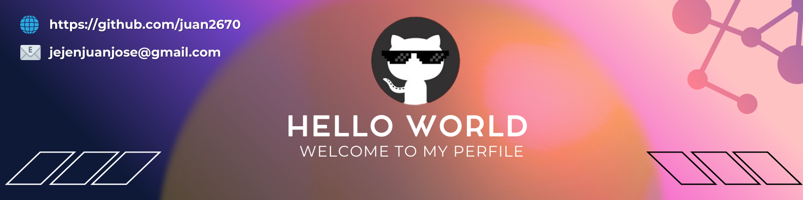

<!-- ====== BANNER ====== -->

<!-- Hero text (replaces the previous right-aligned owl image) -->

  <strong>Always learning, always creating.</strong> 
  Focused on back-end and data analysis — building useful, well-designed products.

<!-- ====== HEADER ====== -->
<h1>
  
  I'm Juan Jose
  (Developer / Programmer)
</h1>

<!-- Animated subtitle -->

  

<!-- ====== INTRO ====== -->

  I’m a Software Engineering student with a passion for turning simple ideas into useful, well-designed products.
  I’m continuously learning and currently focusing on <b>back-end</b> and <b>data analysis</b>, always aiming for creative,
  practical, and results-oriented solutions.

- ✨ Student of life — always learning  
- 🌱 Focused on creating, iterating, and improving products with real impact  
- 🤝 Open to collaborate on real-world challenges

 

<!-- ====== STACK / SKILLS ====== -->
<h2 align="center">🧰 Languages & Tools</h2>

<!-- Row 1: skillicons (incluye PostgreSQL y mantiene MySQL) -->

  

<!-- Row 2: Shields (Power BI + SQL Server) -->

  <!-- Microsoft SQL Server -->
  
  <!-- Power BI -->
  

 

<!-- ====== STATS ====== -->
<h2 align="center">📊 Stats</h2>

  

 

<!-- ====== FEATURED PROJECTS ====== -->
<h2 align="center">⭐ Featured Projects</h2>

  <!-- Face Detection -->
  
  <!-- Geo Infractions – Bogotá Transport -->
  

 

<!-- ====== CONTRIBUTION GRAPH ====== -->
<h2 align="center">📈 Contribution Graph</h2>

  

---

<!-- Connect Section -->
<h2 align="center">🤝 Connect With Me 🤝</h2>

<!-- Animated headline -->

  

<!-- Badges -->

  

  

  

<!-- Subtle separator -->
 

<!-- Footer wave -->

  

